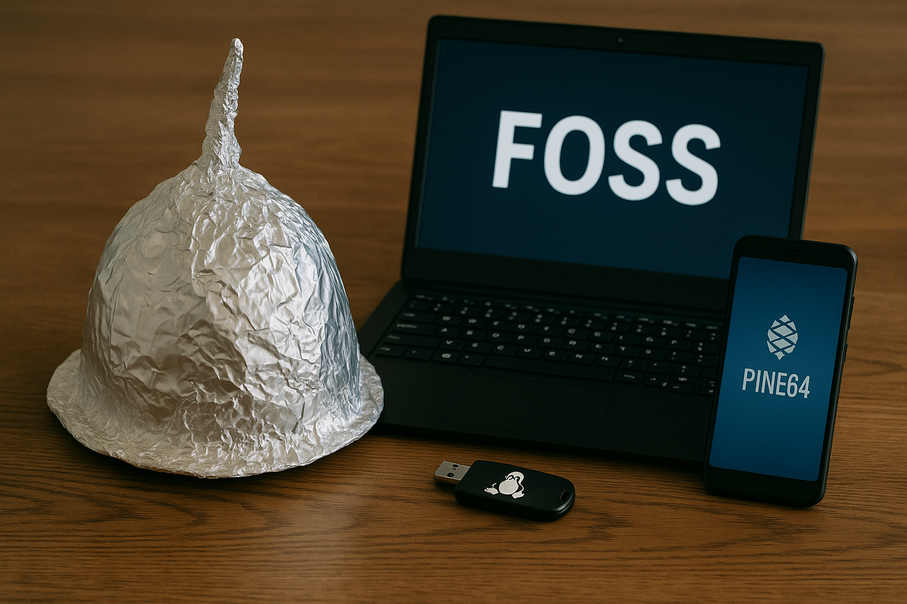

# Plan for Digital Resiliens og Suverænitet

## Hvorfor dette projekt eksisterer

På grund af de nuværende geopolitiske forandringer er det blevet nødvendigt for offentlige institutioner, kommuner og skoler at forholde sig til scenarier, der indtil for nylig virkede usandsynlige. Vi lever i en tid, hvor alliancer, handelsaftaler og adgang til digital infrastruktur ikke længere kan tages for givet.

Dette projekt fokuserer på et specifikt scenarie, hvor **adgangen til amerikansk-baserede IT-tjenester og licensaftaler enten midlertidigt eller permanent bliver tilbagekaldt eller suspenderet** for europæiske institutioner. Det kunne inkludere:

- Tilbagekaldelse af licenser fra Microsoft, Apple, Google eller Cisco
- Nedlukning eller begrænsning af cloud-platforme som Azure, Google Cloud eller iCloud
- Regional blokering af app stores, API-adgang eller enhedsautentifikation
- Tab af adgang til GitHub og anden udviklerinfrastruktur

Selvom dette i øjeblikket er usandsynligt, er det ikke længere utænkeligt. De seneste strømafbrydelser i dele af Vesteuropa og den stigende spænding mellem stormagterne — herunder USA, Kina og Rusland — viser, at vi må forholde os til muligheden for et "licensangreb" eller en politisk motiveret servicenedlukning.

## Fælles ansvar

Vi mener, at vi har et ansvar for at:

- Udarbejde beredskabsplaner for potentielle tjenesteafbrydelser
- Undersøge og dokumentere alternativer, der sikrer driftskontinuitet
- Dele viden og strategier med andre orginsationer
- Bidrage til en bredere bevægelse mod digital suverænitet og åbenhed

Vi deler denne dokumentation i åbenhedens og samarbejdets ånd, ikke som alarmisme. Vores mål er at hjælpe andre i gang med egne planer og at åbne op for dialog og vidensdeling.

Der deles ikke følsomme oplysninger, kodeord eller konkrete sårbarheder. Alle teknologier omtalt er offentligt tilgængelige, fortrinsvis open source, og udvalgt på baggrund af deres evne til at understøtte kritiske funktioner i krisesituationer.

## Bemærkning om neutralitet

Dette dokument er hverken udtryk for antiamerikanske holdninger eller modstand mod store teknologivirksomheder. Tværtimod anerkender vi den værdi og stabilitet, som mange af disse tjenester har bragt over tid. Denne plan er udelukkende en forberedelsesøvelse med fokus på robusthed, forsyningssikkerhed og ansvarlig offentlig IT-drift under usikre globale forhold.

## Målgruppe

- IT-afdelinger i alle typer orginsationer
- Ansvarlige for digital infrastruktur
- Politikere og beslutningstagere med interesse for digital suverænitet
- Open-source-folk og frivillige med interesse for robust IT

## 📚 Indholdsfortegnelse

1. [Faser i Beredskabsplanen (Overblik)](faser-i-beredskabsplanen.md)
2. [Fase 1 – Observation og Forberedende Overvågning](fase-1-observation-og-forberedende-overvågning.md)
3. [Fase 2 – Planlægningsfase](fase-2-planlægningsfase.md)
4. [Fase 3 – Blød Overgang](fase-3-blød-overgang.md)
5. [Fase 4 – Akut Overgang](fase-4-akut-overgang.md)
6. [Fase 5 – Systemfejl og Nødprocedurer](fase-5-systemfejl-og-nødprocedurer.md)
7. [Faseovergang og Eskalationskriterier](faseovergang-og-eskalationskriterier.md)
8. [Licens og Deling](LICENSE.md)

### PDF
Du kan finde en delbar PDF [her](beredskabsplan.pdf)
